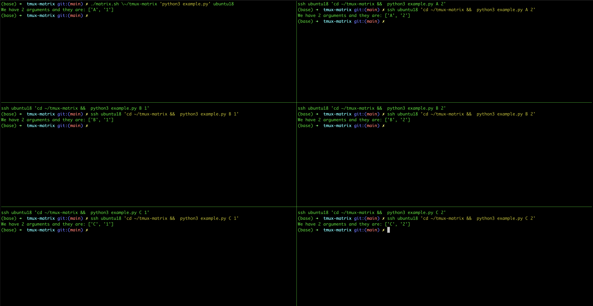

# Tmux Matrix
This program opens up a bunch of tmux windows and passes different arguments to a program of your choice.


It basically does the following:
For each pair of parameter configurations, it first makes a new pane for them, cd's into a specified directory and runs a program, giving it the current pair of parameters as arguments.

It also has the support of doing this on a remote machine using ssh.
## Usages
First, start a tmux session (by typing `tmux`) and then you can run

`./matrix.sh DIR PROG HOST`

Where,
- DIR is the directory to traverse to.
- PROG is the program to execute (without arguments).
- HOST is the host to ssh to if necessary. If left out or equal to 'localhost', this does not ssh at all.
## Example
An example could be the following:

`./matrix.sh \~/tmux-matrix 'python3 example.py' ubuntu18`.

This does the following:
1. It ssh's to a host called `ubuntu18`
2. cd's to the directory `~/tmux-matrix` on the remote machine
3. And executes the command `python3 example.py <ARG1> <ARG2>`, where `<ARG1>` and `<ARG2>` are all possible pairs of arguments as configured in the script.

The output then is 

## Use cases
There are a couple of use cases, among others:

1. Optimising combinations of compilers and MPI implementations for a specific project to optimise speed (the matrix is only for building in parallel)
2. If you have to run the same program multiple times (with or without multiple arguments), and would like to see the output on one screen without tediously making the panes yourself.

## Customisation
The current script is quite silly, and it is just to prove a point. To modify the script for your purposes, change these two lines
```
declare -a first=("A" "B" "C")
declare -a second=("1" "2")
```

to something that captures what you want to do.